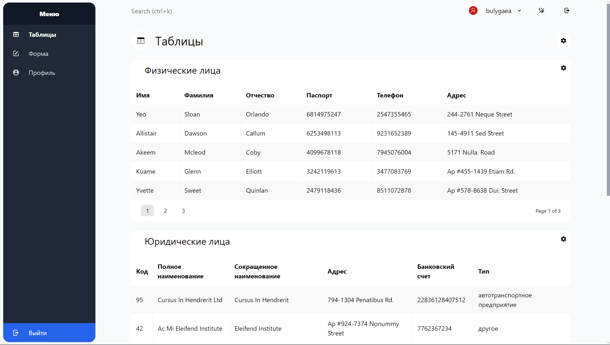
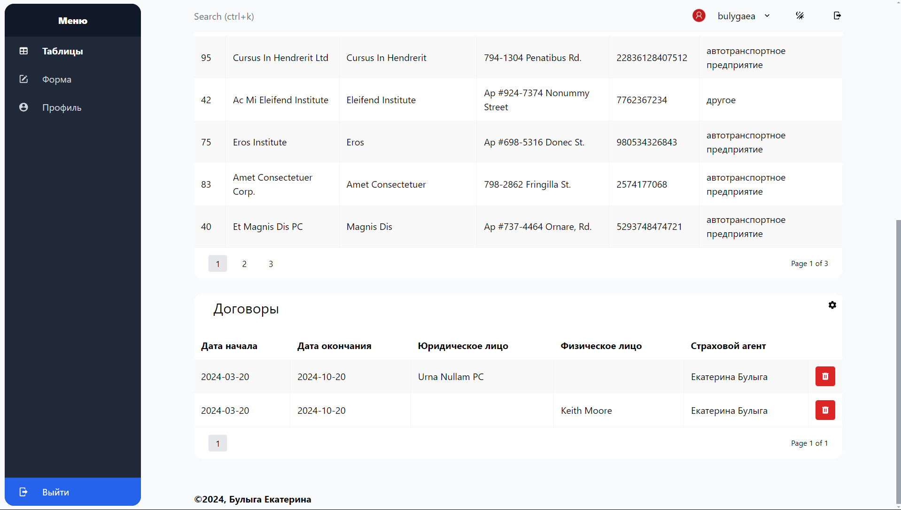

<h1>Главная страница</h1>

На главной странице отражены три таблицы: о физ.лицах, юр.лицах и договорах, составленных данным страховым агентом (=пользователем).

<h2>Шаблон страницы</h2>
<pre>
<code>
&lt;LayoutAuthenticated&gt;
&lt;SectionMain&gt;
  &lt;SectionTitleLineWithButton :icon="mdiTableBorder" title="Таблицы" main/&gt;
  &lt;CardBox class="mb-6" has-table&gt;
    &lt;TableSampleClients checkable/&gt;
  &lt;/CardBox&gt;
  &lt;CardBox class="mb-6" has-table&gt;
    &lt;TableOrganizations checkable/&gt;
  &lt;/CardBox&gt;
  &lt;CardBox class="mb-6" has-table&gt;
    &lt;TableContracts checkable/&gt;
  &lt;/CardBox&gt;
&lt;/SectionMain&gt;
&lt;/LayoutAuthenticated&gt;
</code>
</pre>

<h2>Шаблон таблицы о физических лицах</h2>
<pre>
<code>
&lt;SectionTitleTable title="Физические лица" main/&gt;
&lt;table&gt;
&lt;thead&gt;
&lt;tr&gt;
  &lt;th&gt;Имя&lt;/th&gt;
  &lt;th&gt;Фамилия&lt;/th&gt;
  &lt;th&gt;Отчество&lt;/th&gt;
  &lt;th&gt;Паспорт&lt;/th&gt;
  &lt;th&gt;Телефон&lt;/th&gt;
  &lt;th&gt;Адрес&lt;/th&gt;
&lt;/tr&gt;
&lt;/thead&gt;
&lt;tbody&gt;
&lt;tr v-for="client in itemsPaginated"&gt;
  &lt;td data-label="Name"&gt;
    {{ client.firstname }}
  &lt;/td&gt;
  &lt;td data-label="Surname"&gt;
    {{ client.lastname }}
  &lt;/td&gt;
  &lt;td data-label="Patronymic"&gt;
    {{ client.patronymic }}
  &lt;/td&gt;
  &lt;td data-label="Passport"&gt;
    {{ client.passport }}
  &lt;/td&gt;
  &lt;td data-label="Phone"&gt;
    {{ client.phone }}
  &lt;/td&gt;
  &lt;td data-label="Address"&gt;
    {{ client.address }}
  &lt;/td&gt;
&lt;/tr&gt;
&lt;/tbody&gt;
&lt;/table&gt;
&lt;div class="p-3 lg:px-6 border-t border-gray-100 dark:border-slate-800"&gt;
&lt;BaseLevel&gt;
  &lt;BaseButtons&gt;
    &lt;BaseButton
      v-for="page in pagesList"
      :key="page"
      :active="page === currentPage"
      :label="page + 1"
      :color="page === currentPage ? 'lightDark' : 'whiteDark'"
      small
      @click="currentPage = page"
    /&gt;
  &lt;/BaseButtons&gt;
  &lt;small&gt;Page {{ currentPageHuman }} of {{ numPages }}&lt;/small&gt;
&lt;/BaseLevel&gt;
&lt;/div&gt;
</code>
</pre>

<h2>Шаблон таблицы об юридических лицах</h2>
<pre>
<code>
&lt;SectionTitleTable title="Юридические лица" main/&gt;
&lt;table&gt;
&lt;thead&gt;
  &lt;tr&gt;
    &lt;th&gt;Код&lt;/th&gt;
    &lt;th&gt;Полное наименование&lt;/th&gt;
    &lt;th&gt;Сокращенное наименование&lt;/th&gt;
    &lt;th&gt;Адрес&lt;/th&gt;
    &lt;th&gt;Банковский счет&lt;/th&gt;
    &lt;th&gt;Тип&lt;/th&gt;
  &lt;/tr&gt;
&lt;/thead&gt;
&lt;tbody&gt;
  &lt;tr v-for="item in itemsPaginated" &gt;
    &lt;td data-label="Code"&gt;
      {{ item.code }}
    &lt;/td&gt;
    &lt;td data-label="Fullname"&gt;
      {{ item.fullname }}
    &lt;/td&gt;
    &lt;td data-label="Shortname"&gt;
      {{ item.shortname }}
    &lt;/td&gt;
    &lt;td data-label="Address"&gt;
      {{ item.address }}
    &lt;/td&gt;
    &lt;td data-label="Bank Number"&gt;
      {{ item.bank_number }}
    &lt;/td&gt;
    &lt;td data-label="Type"&gt;
      {{ item.type }}
    &lt;/td&gt;
  &lt;/tr&gt;
&lt;/tbody&gt;
&lt;/table&gt;
&lt;div class="p-3 lg:px-6 border-t border-gray-100 dark:border-slate-800"&gt;
&lt;BaseLevel&gt;
  &lt;BaseButtons&gt;
    &lt;BaseButton
      v-for="page in pagesList"
      :key="page"
      :active="page === currentPage"
      :label="page + 1"
      :color="page === currentPage ? 'lightDark' : 'whiteDark'"
      small
      @click="currentPage = page"
    /&gt;
  &lt;/BaseButtons&gt;
  &lt;small&gt;Page {{ currentPageHuman }} of {{ numPages }}&lt;/small&gt;
&lt;/BaseLevel&gt;
&lt;/div&gt;
</code>
</pre>

<h2>Шаблон таблицы о договорах</h2>
<pre>
<code>
&lt;SectionTitleTable title="Договоры" main/&gt;
&lt;table&gt;
&lt;thead&gt;
&lt;tr&gt;
  &lt;th&gt;Дата начала&lt;/th&gt;
  &lt;th&gt;Дата окончания&lt;/th&gt;
  &lt;th&gt;Юридическое лицо&lt;/th&gt;
  &lt;th&gt;Физическое лицо&lt;/th&gt;
  &lt;th&gt;Страховой агент&lt;/th&gt;
  &lt;th/&gt;
&lt;/tr&gt;
&lt;/thead&gt;
&lt;tbody&gt;
&lt;tr v-for="item in itemsPaginated"&gt;
  &lt;td data-label="Date from"&gt;
    {{ item.date_from }}
  &lt;/td&gt;
  &lt;td data-label="Date to"&gt;
    {{ item.date_to }}
  &lt;/td&gt;
  &lt;td data-label="Organization"&gt;
    {{ item.organization }}
  &lt;/td&gt;
  &lt;td data-label="Client"&gt;
    {{ item.client }}
  &lt;/td&gt;
  &lt;td data-label="Agent"&gt;
    {{ item.agent }}
  &lt;/td&gt;

  &lt;td class="before:hidden lg:w-1 whitespace-nowrap"&gt;
    &lt;BaseButtons type="justify-start lg:justify-end" no-wrap&gt;
      &lt;BaseButton color="danger" :icon="mdiTrashCan" small type="submit" :is="item" @click="onSubmit(item)"/&gt;
    &lt;/BaseButtons&gt;
  &lt;/td&gt;
&lt;/tr&gt;
&lt;/tbody&gt;
&lt;/table&gt;
&lt;div class="p-3 lg:px-6 border-t border-gray-100 dark:border-slate-800"&gt;
&lt;BaseLevel&gt;
  &lt;BaseButtons&gt;
    &lt;BaseButton
      v-for="page in pagesList"
      :key="page"
      :active="page === currentPage"
      :label="page + 1"
      :color="page === currentPage ? 'lightDark' : 'whiteDark'"
      small
      @click="currentPage = page"
    /&gt;
  &lt;/BaseButtons&gt;
  &lt;small&gt;Page {{ currentPageHuman }} of {{ numPages }}&lt;/small&gt;
&lt;/BaseLevel&gt;
&lt;/div&gt;
</code>
</pre>

<h2>Обработка события нажатия на кнопку удаления</h2>
<pre>
<code>
export default {
  methods: {
    async onSubmit(item) {
      const clientName = item.client === '' ? 'default default' : item.client;
      const orgName = item.organization === '' ? 'default' : item.organization;
      const resp0_1 = await axios.get(`http://127.0.0.1:8000/api/organization/?fullname=${orgName}`, {headers: {'Authorization': `Token ${mainStore.token}`}});
      const resp0_2 = await axios.get(`http://127.0.0.1:8000/api/individual/?firstname=${clientName.split(' ')[0]}&lastname=${clientName.split(' ')[1]}`, {headers: {'Authorization': `Token ${mainStore.token}`}});
      const resp0_3 = await axios.get(`http://127.0.0.1:8000/api/insureagent/?username=${mainStore.userName}`, {headers: {'Authorization': `Token ${mainStore.token}`}});
      const resp = await axios.get(`http://127.0.0.1:8000/api/contract/?date_from=${item.date_from}&date_to=${item.date_to}&organization=${resp0_1.data[0].code}&client=${resp0_2.data[0].id}&agent=${resp0_3.data[0].id}`, {headers: {'Authorization': `Token ${mainStore.token}`}});
      await axios.delete(`http://127.0.0.1:8000/api/contract/${resp.data[0].id}/`, {headers: {'Authorization': `Token ${mainStore.token}`}});
      this.$router.go(0);
    }
  }
}
</code>
</pre>
